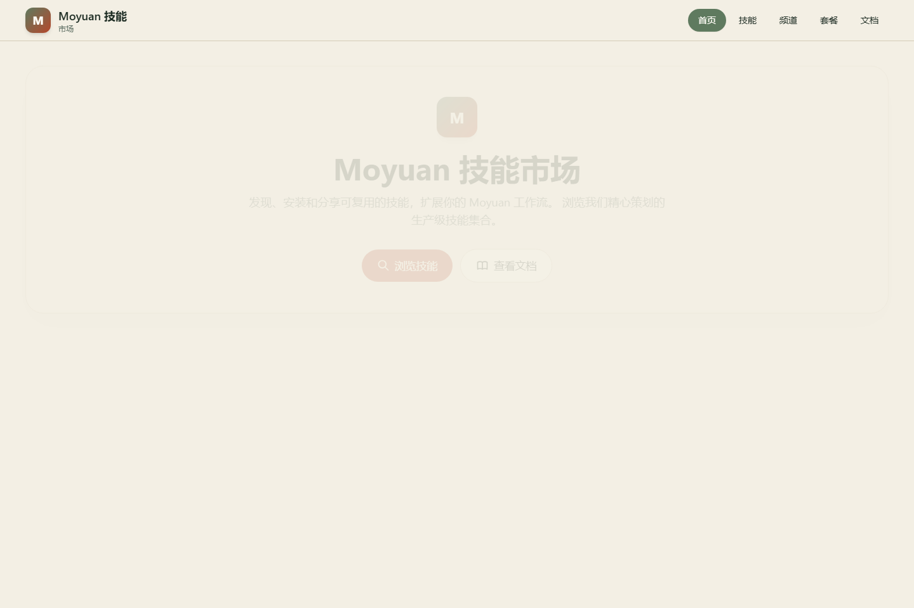
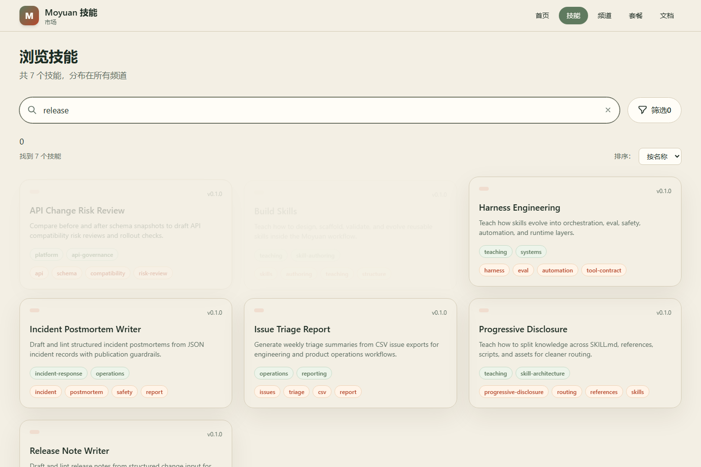
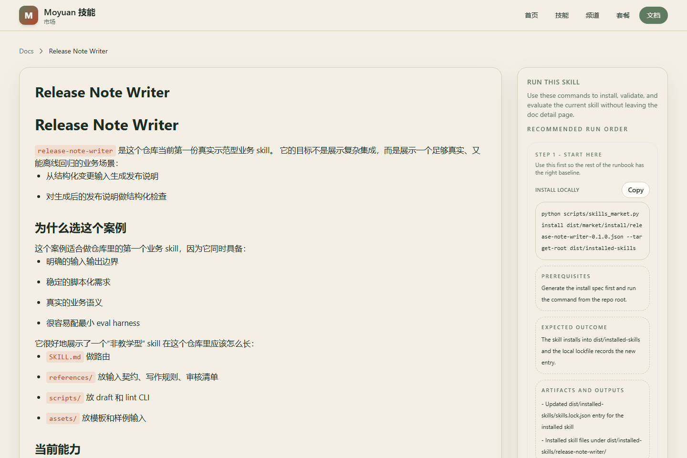

# Moyuan Skills Market

`moyuan-skills` 现在不只是一个 skills 示例仓库，而是一套面向 `skills market` 的教学型参考实现。

它把整个链路拆成了可以学习、可以验证、也可以继续扩展的六层：

1. skill 设计与渐进式披露
2. harness engineering 与 eval
3. market manifest / package / provenance
4. client install / bundle / baseline lifecycle
5. governance / policy / waiver / gate
6. frontend / backend / HTML 交付与联调

## 如果你第一次来到这个项目

推荐直接从教学入口开始，而不是先硬读完整个仓库：

1. [docs/teaching/README.md](./docs/teaching/README.md)
2. [docs/teaching/14-first-hour-onboarding.md](./docs/teaching/14-first-hour-onboarding.md)
3. [docs/skill-learning-guide.md](./docs/skill-learning-guide.md)
4. [docs/teaching/18-skills-market-learning-map.md](./docs/teaching/18-skills-market-learning-map.md)

第一次建议先跑这几条最小校验命令：

- `python scripts/check_progressive_skills.py`
- `python scripts/skills_market.py smoke`
- `python scripts/check_python_market_backend.py`
- `npm run e2e --prefix frontend`

## Playwright 实际使用截图

下面这组图片不是静态示意图，而是用 Playwright 对当前前后端联调链路实际运行后生成的截图。

截图生成命令：

- `npm run build --prefix frontend`
- `npm run capture:readme-screenshots --prefix frontend`

### 1. 首页看到当前 skills market 总览



### 2. 在 skills 页搜索真实 skill



### 3. 进入 skill 详情查看安装入口


### 4. 进入 skill 文档页查看实际运行命令



## `docs/teaching/` 现在承担什么角色

`docs/teaching/` 已经被明确收口成“整个 skills market 的教学目录”。

这里不只讲怎么写一个 skill，还会系统讲清楚：

- skill 设计逻辑为什么要先收口 trigger、router 和 progressive loading
- skill 为什么会继续演进到 harness
- 一个 skill 怎样被打包成 market-ready capability
- client 为什么需要 install、bundle、doctor、snapshot、baseline history
- governance、waiver、source reconcile、gate 怎样进入真实运维链路
- 前端怎样消费 repo-backed docs、skills、bundles 和 registry 数据

最推荐的 skills market 教学路径是：

1. [docs/teaching/01-learning-map.md](./docs/teaching/01-learning-map.md)
2. [docs/teaching/03-build-your-first-skill.md](./docs/teaching/03-build-your-first-skill.md)
3. [docs/teaching/05-harness-roadmap.md](./docs/teaching/05-harness-roadmap.md)
4. [docs/teaching/16-skills-market-evolution.md](./docs/teaching/16-skills-market-evolution.md)
5. [docs/teaching/17-market-registry-and-federation.md](./docs/teaching/17-market-registry-and-federation.md)
6. [docs/teaching/18-skills-market-learning-map.md](./docs/teaching/18-skills-market-learning-map.md)
7. [docs/teaching/19-market-packaging-and-publishing.md](./docs/teaching/19-market-packaging-and-publishing.md)
8. [docs/teaching/20-market-client-operations.md](./docs/teaching/20-market-client-operations.md)
9. [docs/teaching/21-market-governance-and-delivery.md](./docs/teaching/21-market-governance-and-delivery.md)

## 仓库当前能做什么

### 1. 教你设计和维护 skill

- 参考文档见 [docs/skill-authoring.md](./docs/skill-authoring.md)、[docs/progressive-disclosure.md](./docs/progressive-disclosure.md)、[docs/harness-engineering.md](./docs/harness-engineering.md)
- 教学 skill 见 [skills/build-skills/SKILL.md](./skills/build-skills/SKILL.md)、[skills/progressive-disclosure/SKILL.md](./skills/progressive-disclosure/SKILL.md)、[skills/harness-engineering/SKILL.md](./skills/harness-engineering/SKILL.md)

### 2. 展示真实业务 skill 如何进入 market

- 业务案例见 [docs/release-note-writer.md](./docs/release-note-writer.md)、[docs/issue-triage-report.md](./docs/issue-triage-report.md)、[docs/api-change-risk-review.md](./docs/api-change-risk-review.md)、[docs/incident-postmortem-writer.md](./docs/incident-postmortem-writer.md)
- market 规范见 [docs/market-spec.md](./docs/market-spec.md)、[docs/publisher-guide.md](./docs/publisher-guide.md)、[docs/consumer-guide.md](./docs/consumer-guide.md)

### 3. 运行本地 skills market

- package / index / catalog / recommendations / federation / registry 都已经具备本地脚本入口
- 统一入口见 [scripts/skills_market.py](./scripts/skills_market.py)
- registry 与分发层说明见 [docs/market-registry.md](./docs/market-registry.md)

### 4. 跑通 client lifecycle 与治理链路

- install / update / remove / bundle / doctor / repair / baseline / waiver / gate 都已落地
- 治理说明见 [docs/market-governance.md](./docs/market-governance.md)

### 5. 跑通前后端联调

- Python backend 见 [backend/README.md](./backend/README.md)
- 前后端契约与页面映射见 [docs/frontend-backend-integration.md](./docs/frontend-backend-integration.md)
- Playwright 已覆盖首页、skills、bundles、docs 与详情页联调
- backend 现在已经补了本地 lifecycle 接口：`POST /api/v1/local/skills/install`、`POST /api/v1/local/skills/update`、`POST /api/v1/local/skills/remove`、`POST /api/v1/local/bundles/install`、`POST /api/v1/local/bundles/update`、`POST /api/v1/local/bundles/remove`、`GET /api/v1/local/jobs/{job_id}` 和 `GET /api/v1/local/state`
- skill 详情页现在同时提供 `Copy install command` 和 `Run via backend`，bundle 详情页也已经接入 bundle install 的本地执行 UI，同时保留 bundle 级 `install-bundle / update-bundle / remove-bundle` copy-first 命令
- docs 详情页现在会把 repo 命令、顺序提示、前置条件、预期结果和产物输出提示一起展示出来
- 当前前端已经能对 skill install 和 bundle install 走真实 backend 本地执行，backend 也已经补齐 local lifecycle API；但前端还没把 update/remove/state 接上，远端拉取下载也还没补完。后续路线见 [docs/interaction-and-remote-install-roadmap.md](./docs/interaction-and-remote-install-roadmap.md)

## 核心文档入口

- 文档总索引：[docs/README.md](./docs/README.md)
- 教学总入口：[docs/teaching/README.md](./docs/teaching/README.md)
- skills market 学习指南：[docs/skill-learning-guide.md](./docs/skill-learning-guide.md)
- market 规范：[docs/market-spec.md](./docs/market-spec.md)
- market 治理：[docs/market-governance.md](./docs/market-governance.md)
- registry / federation：[docs/market-registry.md](./docs/market-registry.md)
- 前后端集成：[docs/frontend-backend-integration.md](./docs/frontend-backend-integration.md)
- 交互与远端安装规划：[docs/interaction-and-remote-install-roadmap.md](./docs/interaction-and-remote-install-roadmap.md)

## 仓库结构

```text
.
|- backend/
|- frontend/
|- bundles/
|- docs/
|  `- teaching/
|- examples/
|- governance/
|- publishers/
|- schemas/
|- scripts/
|- skills/
`- templates/
```

## 前后端本地端口

- frontend: `33003`
- backend: `38083`

本地联调用法：

```text
python -m uvicorn backend.app.main:app --host 127.0.0.1 --port 38083
set SKILLS_MARKET_API_BASE_URL=http://127.0.0.1:38083
npm run dev:local --prefix frontend
```

## 常用校验命令

- `python scripts/check_progressive_skills.py`
- `python scripts/check_docs_links.py`
- `python scripts/check_harness_prototypes.py`
- `python scripts/check_market_governance.py`
- `python scripts/validate_market_manifest.py`
- `python scripts/check_python_market_backend.py`
- `python scripts/run_eval_harness.py --baseline examples/eval-harness/baseline.json`
- `python scripts/run_harness_runtime.py examples/harness-prototypes/runtime-blueprints/release-note-publication.yaml`
- `python scripts/check_market_pipeline.py --output-root dist/market-smoke-readme`
- `npm run build --prefix frontend`
- `npm run e2e --prefix frontend`

## 一句话定位

如果把这个项目看成一句话，它现在更接近：

“一套从 skill 设计逻辑出发，最终落到 skills market、client lifecycle、governance 和前后端交付的教学型参考实现。”
